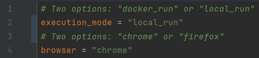
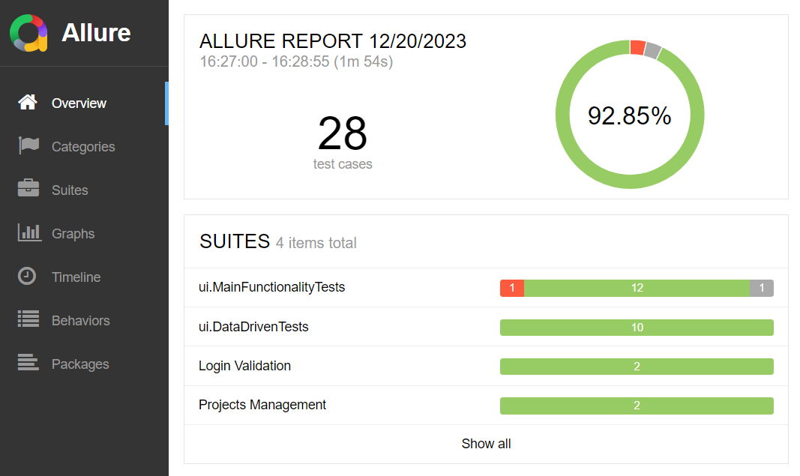

## Project Overview

This __Java__ based project is a testing framework for [Fullstack-TodoApp](https://github.com/naputami/Fullstack-TodoApp).

Essential modules of this __Java__ project: _Apache Maven_, _JUnit 5_, _Selenide_, _Cucumber_, _REST-Assured_, _Allure Report_.  

Additional modules: _Docker_, _Selenoid_

Key features of the project:

### - E2E Testing:
Standard __JUnit 5__ __Selenide__ UI tests covering the main app functionality.
### - Page Object Model Design Pattern:
Each web page is represented by separate Page Class which encapsulates WebElements and operations on them.
### - BDD (Behavior-driven development):
__Cucumber__ framework layer is added on top of existing __JUnit 5__ __Selenide__ UI tests by creating separate __Cucumber__ test runner class for __Cucumber__ feature files.
### - Test environment preparation:
Mechanism written in __REST-Assured__ to achieve an empty application state by interaction with API before each subsequent UI test.
### - JWT token-based authentication handling:
Tokens retrieved using __REST-Assured__ are passed to a browser’s local storage to speed up the login process and accelerate UI tests.
### - DDT (Data-driven testing):
Input data from XLSX file for parametrized test by using POIJI library.
### - Configuration Management:
Loading and managing log-in data, browsers, URLs and etc. in configuration files by using the Typesafe Config library.
### - Test Reporting:
__Allure Report__ is integrated with __JUnit 5__, __Selenide__ and __Cucumber__ project modules to create fancy and clear testing reports.
### - Containerization & Cross Browser Testing:
__Docker__ is user here as option to execute test code in separate container and run tests in one of browser nodes (Chrome or Firefox) connected with __Selenoid__ container through __Docker Compose__.

## Prerequisites

Required components to be installed on your local machine:

- Java JDK 19 or [higher](https://www.oracle.com/java/technologies/downloads/#jdk21-windows)
- [Apache Maven](https://maven.apache.org/download.cgi)
- [Firefox](https://www.mozilla.org/en-US/firefox/new/) or [Chrome browser](https://www.google.com/chrome/)
- [Git](https://git-scm.com/downloads)
- [Docker](https://www.docker.com/products/docker-desktop/)

## Installation & Running Tests

1. Open command line and execute this command to create common network for all containers:
```
docker network create selenoid
```
2. Clone the repository with application under test:
```
git clone https://github.com/mrfurrypants/Fullstack-TodoApp_modified.git
```
3. Point the directory of cloned repository and execute this command to start the app:
```
docker compose up -d
```
3. Clone the repository with testing framework:
```
git clone https://github.com/mrfurrypants/Test_Framework_for_Fullstack-TodoApp.git
```
### After passing these steps there are two options to run tests:
- __Option N°1__: Test code will be executed by JVM directly on your local machine through command line.
  Tests will run in Chrome or Firefox browser installed on local machine. 
- __Option N°2__: Test code will be executed by JVM inside Docker container started from image built on Dockerfile.
  Tests will run remotely in Chrome or Firefox browser located in browser node connected to Selenoid Docker container through Docker Compose.

### Option N°1
1. Open the __\src\test\resources\tests.conf__ file from the root directory of cloned test framework repository, ensure that value of __execution_mode__ is set to "local_run" and set the name of browser to run tests:



2. Point the root directory of this repository in terminal and execute these maven commands:
- to run all tests:
```
mvn clean test
```
- or to run specific test class:
```
mvn clean test -Dtest=CucumberUIRunnerTests
```
```
mvn clean test -Dtest=MainFunctionalityTests
```
```
mvn clean test -Dtest=DataDrivenTests
```


3. Execute this maven command to create Allure report and open it in browser:
```
mvn allure:serve
```
__Several tests may fail due to some of them are flaky!__



### Option N°2
1. Open the __\src\test\resources\tests.conf__ file from the root directory of cloned test framework repository and ensure that value of __execution_mode__ is set to "docker_run" and set the name of browser to run tests:


2. Point the root directory of this repository in terminal and execute this docker command:
```
docker compose up
```
In the command line you can observe the process logs inside containers in real time:
- Start of tests


- Tests result


3. Execute this docker command to delete created containers:
```
docker compose down
```